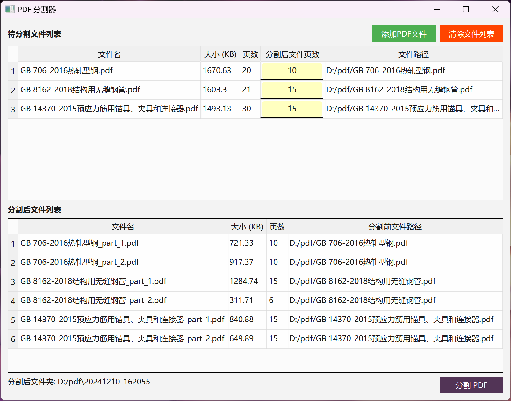

# PDF-Splitter

本项目是一个简单的PDF分割工具，使用PyQt6创建的GUI应用程序。用户可以添加PDF文件并将其分割成多个部分。

## 使用方法

1. 运行程序：
    ```bash
    python main.py
    ```

2. 点击“添加PDF文件”按钮，选择要分割的PDF文件。
3. 在表格中编辑每个文件的分割页数。
4. 点击“分割PDF”按钮，选择保存分割文件的目录。
5. 分割完成后，分割后的文件列表会显示在界面上。
   

## 依赖

- PyQt6
- PyMuPDF

## 贡献

欢迎提交issue和pull request。